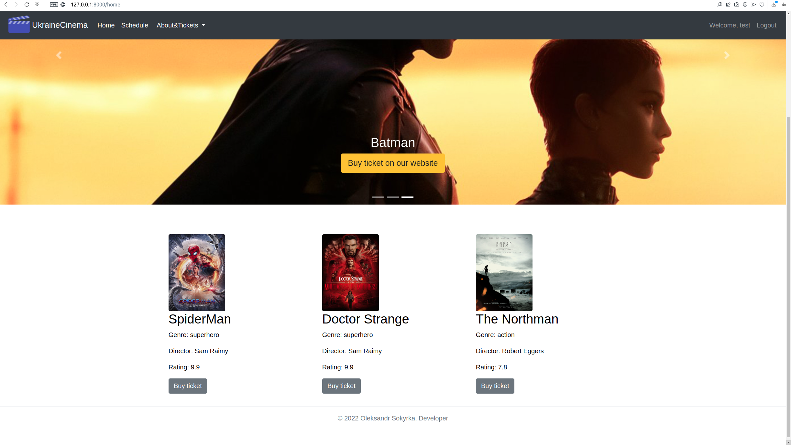

 
 [](https://travis-ci.org/joemccann/dillinger) 

**Official Repo:** https://github.com/lesykbiceps

Welcome! I created a website with an interface, as well as an API with Swagger for cinema with some functionality that will be described below.
So, in general, my program consists of:
- API which is written using the Flask framework
- Website with interface also written using Flask framework and Bootstrap library

These two parts interact with the database and are essentially divided into Blueprints.
It is recommended to use Postman to work with the API where you can register as an administrator, add more halls and movies, and then create a session.
After that, you can test the functionality either in Postman or on the web page. Also, you can fill in the tables with data from the website. To do this, follow the path /admin.
This app contains different levels of access.Here only authenticated admins can list, create, update or delete users.
Authenticated non-admins can change password and see sessions, films, history of their ticket purchases, available seats for the session.
Also they can buy ticket  for a specific session, as well as search for available sessions by film title, genre, actors, director, date and time of the session. Also they have ability to sort available sessions by date.
Unauthenticated users can only see the main page of website with films.
If you are the administrator (default (is_admin: false)), then you have access to all the functionality, including the creation of all entities, their update or removal.

## Pathes

If you are testing in Postman, the program contains the following paths:

| Path | Function |
| ------ | ------ |
| POST /auth/registration {"username": "test", "password": "testpass","age":35, "email":"test", "name":"User"}| Create user and get tokens |
| POST /auth/login {"username": "test", "password": "testpass"}|Get tokens |
| POST /auth/refresh Authorization: Bearer refresh-token-here|Get new access token |
| POST /auth/change-password {"email":"test", "password":"testpass", "new_password":"test"}|Change password |
| POST /auth/logout-access Authorization: Bearer access-token-here|Revoke access token |
| POST /auth/logout-refresh Authorization: Bearer refresh-token-here|Revoke refresh token |

| Path | Function |
| ------ | ------ |
| GET /films| List films |
| POST /films{    "name":"Spiderman","genre":"Spiderman","director":"Spiderman","rating":8.9,"image": "{your image address}"}| Create a film |
| GET /films/{id}| Get film by id |
| PATCH /films/{id} {"name": "Spider-Man"}| Update film by id |
| DELETE /films/{id}| Delete film by id |

| Path | Function |
| ------ | ------ |
| GET /halls| List halls |
| POST /halls {"name": "DOCKER", "capacity":50}| Create a hall |
| GET /halls/{id}| Get hall by id |
| PATCH /halls/{id} {"capacity":100}| Update hall by id |
| DELETE /halls/{id}| Delete hall by id |

| Path | Function |
| ------ | ------ |
| GET /sessions| List sessions |
| GET /sessions{your filter,for example:} ?sort= True | List sorted sessions(as example) |
| POST /sessions {"film_id": 1, "hall_id":1, "started_at": "2022-07-05 23:10:00"}| Create a session |
| DELETE /sessions/{id}| Delete session by id |

| Path | Function |
| ------ | ------ |
| GET /tickets  | List tickets |
|GET /mytickets  | History of ticket purchases |
|GET /free_seats/{id}  | See which places are available for a particular session |
|GET /tickets/{id}  | Admin can view a statistic of sold tickets for selected film |
|POST /tickets {"seat":3,"user_id":1, "session_id":3}  | Create a ticket or it is the same as buying a ticket |

| Path | Function |
| ------ | ------ |
| GET /actors| List actors |
| POST /actors| Create a actor |
| DELETE /actors/{id}| Delete actor by id |

| Path                                                                                                  | Function           |
|-------------------------------------------------------------------------------------------------------|--------------------|
| GET /users                                                                                            | list users |         
| POST /users {"name":"bob", "age":24, "password":"passwordbob", "username":"bob1234", "is_admin":true} | create a user |      
| GET /users/{id}                                                                                       | get user by id |     
| PATCH /users/{id}                                                                                     | update user by id  |
| DELETE /users/{id}                                                                                    | delete user by id  |

## Additional info(Example of usage)
To better organize the work on the project and review the functionality, I follow the steps below
Also you should have docker  installed if you want to use a docker(!noticed a different display of the carousel if you use a docker)
For example:
- Open postman and perform registration to get access token(if need next time you can only refresh token )
- Create a halls and films with their fields and create sessions for them
- That's enough to see the basic functionality with following paths in postman or website

You can register(/register) and fill in the required fields(/admin) via the website or Postman


# Quick Install

```bash
pip install -r requirements.txt
python run.py
```
OR
```bash
pip install -r requirements.txt
docker-compose up
```


# All additional requirements to the project are observed:
- Documentation (docstring) to functions
- README
- Flake 8
- Covered with pytest tests
- It can be started as from one of the command:
    python run.py
    OR
    docker compose-up




## License
MIT
**Free Software, Hell Yeah!**

